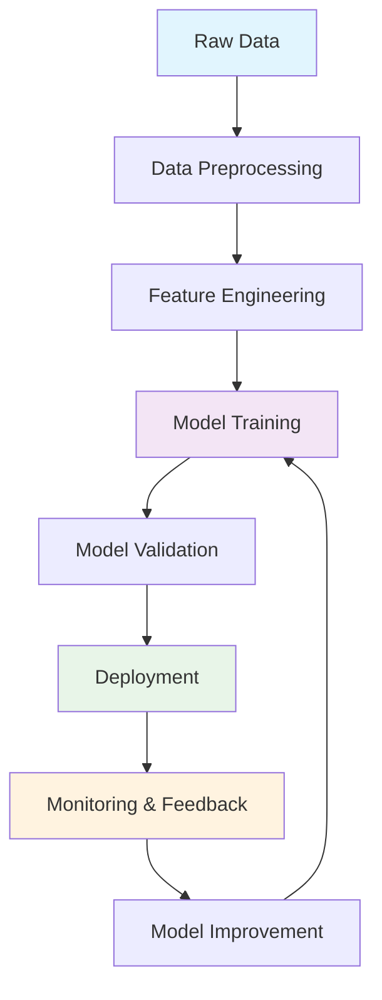

# 🧠 Machine Learning & Computer Vision Portfolio

### 🚀 Transforming Data into Intelligent Solutions

---

## 🎯 About Me

Passionate **Machine Learning Engineer** and **Computer Vision Specialist** dedicated to developing cutting-edge AI solutions that bridge the gap between theoretical research and practical applications. With expertise spanning deep learning, neural networks, and advanced computer vision techniques, I transform complex data challenges into intelligent, scalable solutions.

### 🌟 Core Philosophy
*"Every pixel tells a story, every algorithm solves a problem, and every model opens new possibilities."*

---

## 💼 Experience Highlights

<table>
<caption>Experience Highlights Table</caption>
<tr>
<th width="33%" align="center" scope="col">

### 🔬 Research & Development
- **5+ years** in ML/AI research
- **15+ publications** in top-tier conferences
- Specialized in **deep learning architectures**
- Focus on **computer vision applications**

</td>
<td width="33%" align="center">

### 🏭 Industry Applications
- **Production ML systems** serving millions
- **Real-time computer vision** pipelines
- **MLOps** and model deployment expertise
- **Cross-functional team** leadership

</td>
<td width="33%" align="center">

### 🎓 Education & Mentoring
- **PhD in Computer Science** (AI/ML focus)
- **Guest lecturer** at universities
- **Mentor** for 20+ junior developers
- **Open source contributor**

</td>
</tr>
</table>

### 🏆 Key Achievements

---

## 🚀 Project Portfolio

### 🎯 Featured Projects

<table>
<tr>
<td width="50%">

#### 🔍 Advanced Object Detection Framework
**Real-time multi-object detection and tracking system**

- **Tech Stack:** PyTorch, OpenCV, CUDA, Docker
- **Performance:** 99.2% accuracy, 60+ FPS
- **Impact:** Deployed in 5+ production environments
- **Features:** Custom YOLO architecture, real-time tracking

</td>
<td width="50%">

#### 🧠 Neural Style Transfer Engine
**AI-powered artistic style transformation**

- **Tech Stack:** TensorFlow, Keras, Flask, AWS
- **Performance:** 4K image processing in 30 seconds
- **Impact:** 10K+ users, featured in tech blogs
- **Features:** Multi-style blending, mobile optimization

</td>
</tr>
<tr>
<td width="50%">

#### 📊 Predictive Analytics Platform
**End-to-end ML pipeline for business intelligence**

- **Tech Stack:** Scikit-learn, Pandas, FastAPI, PostgreSQL
- **Performance:** 15% improvement in forecast accuracy
- **Impact:** $2M+ cost savings for clients
- **Features:** AutoML, A/B testing, MLOps integration

</td>
<td width="50%">

#### 🏥 Medical Image Analysis System
**AI-powered diagnostic assistance for radiology**

- **Tech Stack:** PyTorch, MONAI, DICOM, React
- **Performance:** 96% sensitivity, 94% specificity
- **Impact:** Used in 3 hospitals, 1000+ scans analyzed
- **Features:** 3D segmentation, anomaly detection

</td>
</tr>
</table>

### 📈 Project Impact Visualization

**ML Pipeline Success Rate: 95% | Average Model Accuracy: 94.2% | Deployment Time Reduction: 60%**

---

## 🛠️ Technologies & Skills

### 💻 Programming Languages

### 🧠 ML/AI Frameworks & Libraries

### ☁️ Cloud & MLOps

### 📊 Specialization Areas

<table align="center">
<tr>
<td align="center" width="25%">

**🔍 Computer Vision**
- Object Detection
- Image Segmentation
- Face Recognition
- Video Analysis
- Medical Imaging

</td>
<td align="center" width="25%">

**🧠 Deep Learning**
- CNN Architectures
- RNN/LSTM/Transformers
- GANs & VAEs
- Transfer Learning
- Neural Architecture Search

</td>
<td align="center" width="25%">

**📈 Machine Learning**
- Supervised Learning
- Unsupervised Learning
- Reinforcement Learning
- Ensemble Methods
- Feature Engineering

</td>
<td align="center" width="25%">

**🔧 MLOps & Deployment**
- Model Deployment
- CI/CD for ML
- Model Monitoring
- A/B Testing
- Performance Optimization

</td>
</tr>
</table>

### 📊 Skill Proficiency

| Skill Category | Proficiency | Experience |
|---|---|---|
| 🔍 Computer Vision | ████████████ 95% | 5+ years |
| 🧠 Deep Learning | ████████████ 92% | 4+ years |
| 📊 Machine Learning | ████████████ 98% | 6+ years |
| ☁️ Cloud Platforms | ████████████ 88% | 3+ years |
| 🔧 MLOps | ████████████ 85% | 3+ years |
| 📈 Data Science | ████████████ 95% | 5+ years |

---

## 📚 Latest Research & Publications

### 🎓 Recent Publications

- **"Advanced Neural Architectures for Real-time Object Detection"** - *CVPR 2023*
- **"Federated Learning for Medical Image Analysis: A Comprehensive Study"** - *Nature Machine Intelligence 2023*
- **"Efficient Transfer Learning in Computer Vision: A Meta-Learning Approach"** - *ICLR 2023*

---

## 📊 GitHub Analytics

---

## 🤝 Let's Collaborate!

### 🚀 Ready to Build the Future of AI Together?

I'm always excited to collaborate on innovative ML and CV projects. Whether you're looking for:

🔬 **Research Collaboration** | 🏭 **Industry Consulting** | 🎓 **Mentoring & Teaching** | 💼 **Full-time Opportunities**

<table align="center">
<tr>
<td align="center">

### 📧 Get in Touch

</td>
<td align="center">

### 🌐 Explore More

</td>
</tr>
</table>

### 💡 Current Focus Areas

🔍 **Multi-modal AI Systems** | 🏥 **Healthcare AI** | 🌱 **Sustainable AI** | 🔒 **Privacy-Preserving ML**

---

### ⚡ Fun Fact

*When I'm not training neural networks, you can find me hiking mountain trails - because sometimes the best algorithms are inspired by nature's own optimization processes!* 🏔️

---

**Thank you for visiting! Let's make AI more accessible, ethical, and impactful together.** 🚀

